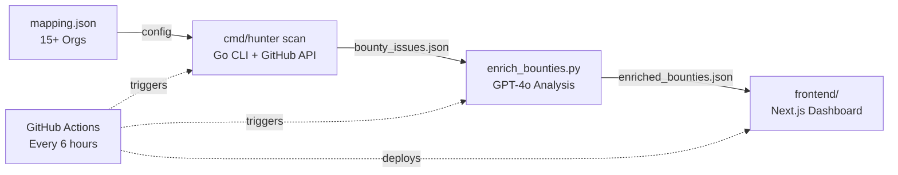

# PD-Hunter

**Open Source Bounty Intelligence Platform**

Find high-value open source bounties matched to your skills, powered by AI.

<div align="center">

[](https://github.com/FuZoe/PD-Hunter/actions/workflows/ci.yml)
[](https://github.com/FuZoe/PD-Hunter)
[](LICENSE)
[](mapping.json)

[English] | [简体中文](./README_CN.md)

</div>

---

## Features

- **15+ Organizations** — Tracks bounties across projectdiscovery, supabase, cal-com, appwrite, and more
- **AI-Powered Analysis** — GPT-4o generates friction level, technical hints, and bounty tier for each issue
- **Hunter Cards** — Beautiful hacker-themed dashboard with filtering, sorting, and search
- **S-Tier Highlighting** — High-value ($1000+) bounties prominently featured with glow effects
- **Hidden Gems Detection** — Find low-competition opportunities with customizable thresholds
- **Expert Hint Preservation** — Manual expert hints preserved across automated updates
- **Auto-Update** — GitHub Actions refreshes data every 6 hours
- **Full-Text Search** — Search bounties by title, repo, label, or technical hint

## Quick Start

### Option 1: CLI (Go)

```bash
# Install
go install github.com/FuZoe/PD-Hunter/cmd/hunter@latest

# Scan all organizations
export GITHUB_TOKEN=your_token
hunter scan --config mapping.json --output bounty_issues.json
```

### Option 2: Full Pipeline

```bash
# 1. Clone
git clone https://github.com/FuZoe/PD-Hunter.git
cd PD-Hunter

# 2. Scan bounty issues
export GITHUB_TOKEN=your_token
go run ./cmd/hunter scan

# 3. Enrich with AI
pip install -r requirements.txt
python enrich_bounties.py

# 4. Start dashboard
cd frontend && npm install && npm run dev
# Open http://localhost:3000
```

## Architecture



### Pipeline Stages

1. **Scan** — The Go CLI (`cmd/hunter scan`) reads `mapping.json` for target organizations and bounty labels, queries the GitHub Search API, counts open PRs per issue, and deduplicates results into `bounty_issues.json`.

2. **Enrich** — The Python script (`enrich_bounties.py`) feeds each issue to GPT-4o via GitHub Models to produce *Hunter Intelligence*: friction level, technical hint, bounty tier (S/A/B), and Hidden Gem flag. Expert hints are preserved across runs.

3. **Publish** — GitHub Actions runs the pipeline every 6 hours with data validation and failure alerting. The Next.js dashboard loads the enriched JSON and renders it as a filterable, searchable, hacker-themed card view.

## Project Structure

```
PD-Hunter/
├── cmd/hunter/          # Go CLI entry point (cobra)
├── pkg/
│   ├── scraper/         # GitHub API client, config loader, types
│   └── exporter/        # JSON export
├── frontend/            # Next.js 14 + Tailwind + shadcn/ui
│   ├── src/app/         # Pages (dashboard)
│   ├── src/components/  # BountyCard, FilterBar, StatsPanel
│   ├── src/hooks/       # useBounties, useFilters
│   └── src/lib/         # Types, utilities, API
├── enrich_bounties.py   # AI enrichment (GPT-4o)
├── mapping.json         # Organization tracking config
├── static/              # Legacy static dashboard
└── .github/workflows/   # CI + auto-update pipelines
```

## Tech Stack

| Layer | Technology |
|-------|-----------|
| **CLI** | Go 1.22 + cobra |
| **AI Analysis** | Python + OpenAI (GPT-4o via GitHub Models) |
| **Frontend** | Next.js 14 + Tailwind CSS + Lucide Icons |
| **CI/CD** | GitHub Actions (lint + test + build + deploy) |
| **Testing** | Go test (88% coverage) + ESLint + TypeScript |

## Contributing

We welcome contributions! See [CONTRIBUTING.md](CONTRIBUTING.md) for guidelines.

Common ways to contribute:
- **Add organizations** — Edit `mapping.json` and submit a PR
- **Report bugs** — Use the [Bug Report template](.github/ISSUE_TEMPLATE/bug_report.md)
- **Request features** — Use the [Feature Request template](.github/ISSUE_TEMPLATE/feature_request.md)

## License

[MIT](LICENSE)
