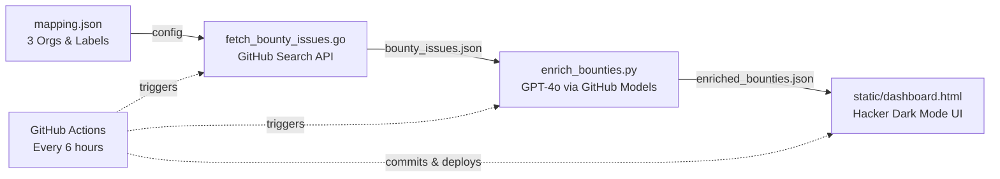

# PD-Hunter Intelligence

AI-powered bounty intelligence dashboard for ProjectDiscovery repositories.

<div align="center">
  <a>[English]</a> | <a href="./README_CN.md">[简体中文]</a>
</div>

## Preview

see the [dashboard](https://fuzoe.github.io/PD-Hunter/static/dashboard.html)

## Features

- **Hunter Cards** - Technical hints, bounty amounts, friction levels
- **S-Tier Highlighting** - High-value bounties prominently featured
- **Expert Hint Preservation** - Manual hints preserved across updates
- **Auto-Update** - GitHub Actions refreshes data every 6 hours

## Quick Start

### Local Run

```bash
# 1. Fetch bounty issues
go run fetch_bounty_issues.go

# 2. Enrich with AI (requires GITHUB_TOKEN)
export GITHUB_TOKEN=your_token
pip install -r requirements.txt
python enrich_bounties.py

# 3. Copy to static folder
cp enriched_bounties.json static/

# 4. Open dashboard
# Open static/dashboard.html in browser
```

### GitHub Pages

Deploy to GitHub Pages and the dashboard auto-updates every 6 hours.

## How it works

PD-Hunter runs a three-stage pipeline to continuously surface and rank open-source bounty opportunities:



1. **Scrape** — A Go program (`fetch_bounty_issues.go`) reads `mapping.json` for target organizations (projectdiscovery, onyx-dot-app, commaai) and their bounty labels, then queries the GitHub Search API to collect all matching open issues. For each issue it also counts open PRs to gauge competition. Results are saved to `bounty_issues.json`.

2. **Enrich** — A Python script (`enrich_bounties.py`) feeds each issue to GPT-4o via GitHub Models and produces per-issue *Hunter Intelligence*: friction level (High / Medium / Low), a one-sentence technical hint, bounty tier (S / A / B based on dollar amount), and a Hidden Gem flag for low-competition opportunities. Previously reviewed expert hints are preserved across runs.

3. **Publish** — A GitHub Actions workflow (`.github/workflows/update_bounties.yml`) runs the above two steps every 6 hours, copies the enriched JSON into `static/`, and commits the update. The dashboard (`static/dashboard.html`) loads this JSON client-side and renders it as a filterable, hacker-themed card view.

## License

MIT
