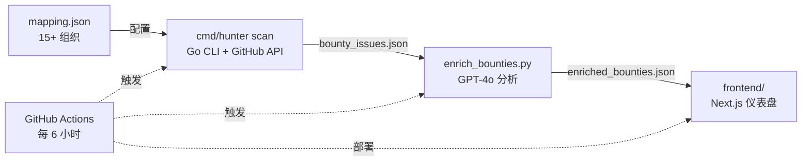

# PD-Hunter

**开源赏金情报平台**

AI 驱动，帮你找到匹配技能的高价值开源赏金。

<div align="center">

[](https://github.com/FuZoe/PD-Hunter/actions/workflows/ci.yml)
[](https://github.com/FuZoe/PD-Hunter)
[](LICENSE)
[](mapping.json)

[English](./README.md) | [简体中文]

</div>

---

## 功能特点

- **15+ 组织追踪** — 覆盖 projectdiscovery、supabase、cal-com、appwrite 等
- **AI 智能分析** — GPT-4o 生成摩擦等级、技术提示和赏金分级
- **猎人卡片** — 暗黑主题仪表盘，支持筛选、排序和搜索
- **S-Tier 高亮** — $1000+ 高价值赏金醒目展示
- **Hidden Gems 检测** — 发现低竞争机会，阈值可自定义
- **专家提示保留** — 人工提示在自动更新时不被覆盖
- **自动更新** — GitHub Actions 每 6 小时刷新数据
- **全文搜索** — 按标题、仓库、标签或技术提示搜索

## 快速开始

### 方式一：CLI (Go)

```bash
# 安装
go install github.com/FuZoe/PD-Hunter/cmd/hunter@latest

# 扫描所有组织
export GITHUB_TOKEN=your_token
hunter scan --config mapping.json --output bounty_issues.json
```

### 方式二：完整流水线

```bash
# 1. 克隆
git clone https://github.com/FuZoe/PD-Hunter.git
cd PD-Hunter

# 2. 扫描赏金 issues
export GITHUB_TOKEN=your_token
go run ./cmd/hunter scan

# 3. AI 富化分析
pip install -r requirements.txt
python enrich_bounties.py

# 4. 启动仪表盘
cd frontend && npm install && npm run dev
# 打开 http://localhost:3000
```

## 架构



### 流水线阶段

1. **扫描** — Go CLI (`cmd/hunter scan`) 读取 `mapping.json` 配置，通过 GitHub Search API 收集匹配的 open issues，统计 PR 竞争程度，去重后保存至 `bounty_issues.json`。

2. **分析** — Python 脚本 (`enrich_bounties.py`) 调用 GPT-4o 生成猎人情报：摩擦等级、技术提示、赏金等级（S/A/B）和 Hidden Gem 标记。已有专家提示会被保留。

3. **发布** — GitHub Actions 每 6 小时执行流水线，包含数据校验和失败告警。Next.js 仪表盘加载富化 JSON，渲染为可筛选的暗黑主题卡片视图。

## 项目结构

```
PD-Hunter/
├── cmd/hunter/          # Go CLI 入口 (cobra)
├── pkg/
│   ├── scraper/         # GitHub API 客户端、配置加载、类型定义
│   └── exporter/        # JSON 导出
├── frontend/            # Next.js 14 + Tailwind + shadcn/ui
│   ├── src/app/         # 页面（仪表盘）
│   ├── src/components/  # BountyCard, FilterBar, StatsPanel
│   ├── src/hooks/       # useBounties, useFilters
│   └── src/lib/         # 类型、工具函数、API
├── enrich_bounties.py   # AI 富化脚本 (GPT-4o)
├── mapping.json         # 组织追踪配置
├── static/              # 旧版静态仪表盘
└── .github/workflows/   # CI + 自动更新流水线
```

## 技术栈

| 层级 | 技术 |
|------|------|
| **CLI** | Go 1.22 + cobra |
| **AI 分析** | Python + OpenAI (GPT-4o via GitHub Models) |
| **前端** | Next.js 14 + Tailwind CSS + Lucide Icons |
| **CI/CD** | GitHub Actions (lint + test + build + deploy) |
| **测试** | Go test (88% 覆盖率) + ESLint + TypeScript |

## 贡献

欢迎参与贡献！请阅读 [CONTRIBUTING.md](CONTRIBUTING.md) 了解详情。

## 许可证

[MIT](LICENSE)
