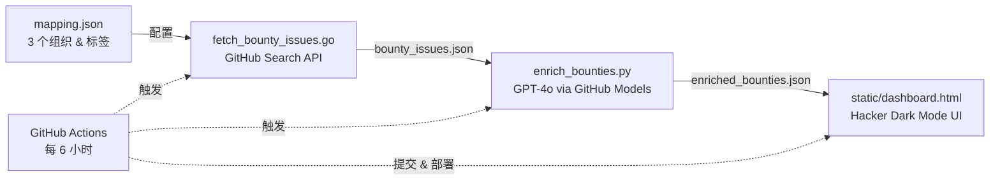

# PD-Hunter 赏金猎人情报中心

AI 驱动的 Github 赏金情报仪表盘。

<div align="center">
  <a href="./README.md">[English]</a> | [简体中文]</a>
</div>

## 直接预览

see the [**dashboard**](https://fuzoe.github.io/PD-Hunter/static/dashboard.html)

## ✨ 功能特点

- **猎人卡片** - 技术提示、赏金金额、难度等级
- **S-Tier 高亮** - 高价值赏金醒目显示
- **专家提示保留** - 人工提示不会被 AI 覆盖
- **自动更新** - GitHub Actions 每 6 小时刷新数据

## 🚀 快速开始

### 本地运行

```bash
# 1. 爬取赏金 issues
go run fetch_bounty_issues.go

# 2. AI 分析 (需要 GITHUB_TOKEN)
export GITHUB_TOKEN=你的_token
pip install -r requirements.txt
python enrich_bounties.py

# 3. 复制到 static 文件夹
cp enriched_bounties.json static/

# 4. 打开仪表盘
# 浏览器打开 static/dashboard.html
```

### GitHub Pages 部署

部署到 GitHub Pages 后，仪表盘每 6 小时自动更新。

**在线访问**：https://fuzoe.github.io/PD-Hunter/static/dashboard.html

## 工作原理

PD-Hunter 通过三阶段流水线持续挖掘和排序开源赏金机会：



1. **抓取** — Go 程序 (`fetch_bounty_issues.go`) 读取 `mapping.json` 中的目标组织（projectdiscovery、onyx-dot-app、commaai）及其赏金标签，通过 GitHub Search API 收集所有匹配的 open issues，并统计每个 issue 的 open PR 数量以评估竞争程度。结果保存至 `bounty_issues.json`。

2. **分析** — Python 脚本 (`enrich_bounties.py`) 将每个 issue 送入 GPT-4o（通过 GitHub Models），生成猎人情报（*Hunter Intelligence*）：摩擦等级（高/中/低）、一句话技术提示、赏金等级（S/A/B，按金额划分）以及低竞争 Hidden Gem 标记。已有的人工专家提示在更新时会被保留。

3. **发布** — GitHub Actions 工作流 (`.github/workflows/update_bounties.yml`) 每 6 小时自动执行上述两步，将富化后的 JSON 复制到 `static/` 目录并提交更新。仪表盘 (`static/dashboard.html`) 在客户端加载 JSON，渲染为可筛选的暗黑主题卡片视图。

## 🔧 技术栈

- **Go 1.22+** - 爬虫
- **Python 3.11+** - AI 分析
- **OpenAI SDK** - 调用 GitHub Models (GPT-4o)
- **Tailwind CSS** - 样式
- **GitHub Actions** - 自动化

## 🎯 赏金分级

| 等级 | 金额 | 说明 |
|------|------|------|
| **S-Tier** | $500+ | 高价值，值得深入研究 |
| **A-Tier** | $200+ | 中等价值 |
| **B-Tier** | 其他 | 入门级 |

## 📝 Expert Hint Preservation

AI 分析时会保留已有的人工专家提示：

```python
if issue_num in existing_intel:
    # 保留人工提示，不调用 AI
else:
    # 新 issue → 调用 AI 分析
```

## 📄 许可证

MIT
